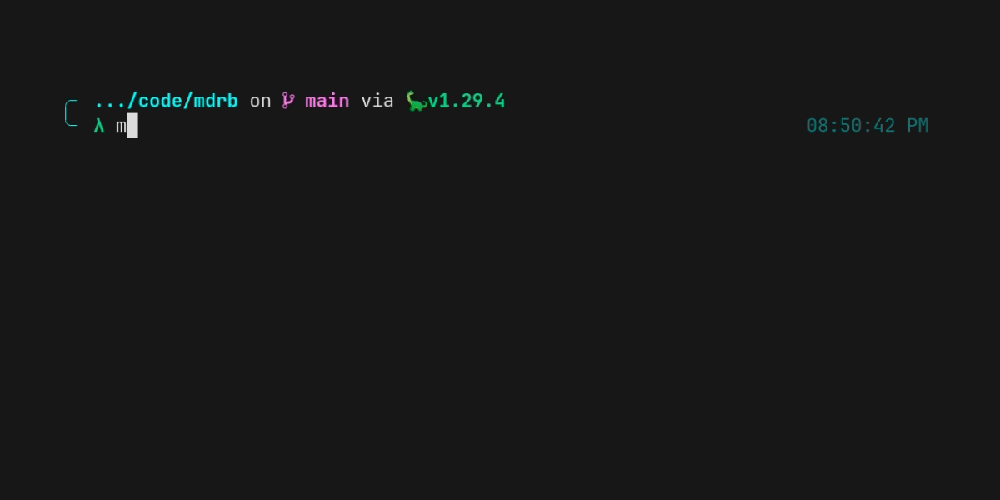
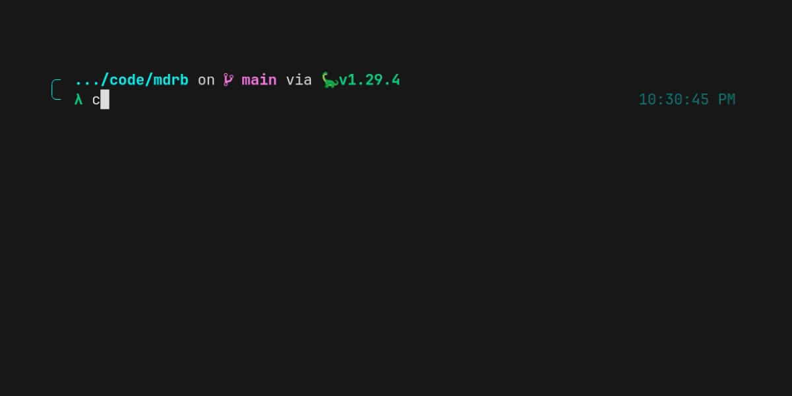
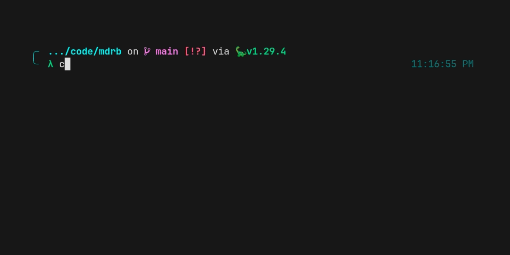

<h1 align="center">
  <br>
    
  <br>
  Markdown Run Book
  <br>
  <br>
</h1>

<p align="center">Turn your Markdown documentation into executable runbooks.</p>

<p align="center">
  <a href="https://github.com/andrewbrey/mdrb/actions/workflows/ci.yml">
    
  </a>
  <a href="https://deno.land/x/mdrb">
    
  </a>
</p>

---

## Features

- 🦕 Built with and runs on [Deno](https://deno.land)
- 🌀 Blend documentation with code execution; bring your `README.md` developer setup to life without losing the
  narrative format
- ✅ Execute `TypeScript` and `JavaScript` fenced code blocks as a multi-step "runbook"
- ✨ Automatic availability of [dsherret/dax](https://deno.land/x/dax) within code blocks to simplify cross-platform
  shell execution
- ⬇ Works with local and remote Markdown files and even Markdown content piped to `stdin`

## Motivation and How it Works

How many times have you had to follow along with a set of steps in a `README.md` in order to setup your development
environment to work on a project? Copy-and-Paste-ing from the `README` to your terminal back and forth, hoping you do
each step correctly and don't miss something gets old; wouldn't it be nice if you could just _execute_ the code in that
`README`? Well, that's what `mdrb` allows you to do!

When provided a Markdown file (or a remote URL that points to one, or pipe the content of one through `stdin`) to
`mdrb`, it does the following:

1. Extract all of the _fenced_ code blocks which are annotated with a valid `TypeScript` or `JavaScript` language code
   (`typescript`, `ts`, `javascript`, and `js`)
1. Pull out the code from each and do a bit of processing to allow it to work seamlessly with `Deno`
   - for example, references to `import.meta.url` need to be rewritten with the litteral value of the source Markdown
     file
1. (_optionally, but by default_) add an import of the bundled version of [dax](https://deno.land/x/dax) to the code
   that will be executed
   - From the `dax` module the `$` object is exposed automatically to your code blocks, allowing them to transparently
     reference the functions and features (of which there are many) of `$` - most important of which is the execution of
     cross-platform shell commands.
1. Execute the code blocks according to the chosen mode; by default the "`runbook`" mode is used, which treats each code
   block as an isolated script and execution is paused awaiting your confirmation before going on.
   - "`isolated`" mode is the same as "`runbook`" mode, except that there is no pause to prompt between each code block.
     This is the mode used instead of `runbook` for all _piped_ content due to the absence of a `tty`.
   - "`single`" mode concatenates your code blocks together as if they were all a single script and executes the
     resulting _single_ block. In this mode, your code blocks can depend on each other, but be careful about things like
     re-declaring variables across code blocks - at runtime, they aren't isolated from each other!

## Installation

```sh
deno install -Arfn mdrb https://deno.land/x/mdrb/mod.ts
```

> Note: if you prefer not to bake `--allow-all` permissions (with the `-A` flag) into the installed command, you can
> specify alternate permissions, e.g. `deno install --allow-net -rfn mdrb https://deno.land/x/mdrb/mod.ts` but be aware
> that this means you will be prompted for permissions at runtime.

## Demo

### Local Markdown

> Within the source repository for `mdrb`, execute `mdrb` on the local [demo.md file](demo.md). This results in
> executing the 3 included (`ts/js`) code blocks as a "runbook", pausing execution after each step awaiting user
> confirmation to proceed.



### Remote Markdown

> Just like when we referenced the local `demo.md` file, we can also just reference the demo Markdown by a URL.

🧪 Try it yourself with:

```sh
mdrb https://deno.land/mdrb/demo.md
```


> Note that in this demo, we used "`isolated`" mode instead of the default "`runbook`" mode which omits the pauses for
> confirmation between code blocks

### Piped Markdown

> We can also pipe the Markdown content to `mdrb`



> Note that for this demo, even though we didn't manually specify "`isolated`" mode, `mdrb` used it instead of the
> normal default of "`runbook`" mode because the prompts will fail if we don't have a `tty`

### Using `dax`

> There are a **ton** of useful things you can do with `dax`, so here's a little showcase of _some_ of what you can do
> with the automatically added `$` object.



### Skipping automatic `dax` addition

> If you don't want `dax` to be automatically added to your code blocks, you can pass the `--dax=false` option


## Gotchas

1. You can't have **any** single quote characters (`'`) inside any `ts/js` code blocks, or a runtime error will be
   thrown.
   - This is due to a limitation in which characters are URL encoded by `encodeURIComponent` (notably, single quotes not
     being encoded), and the fact that `mdrb` runs your code blocks as a URL encoded data URI internally.
   - This limitation may be addressed later, but for now, throwing is the only good option if single quotes are
     encountered when parsing out the executable code blocks.

## Prior Art

- https://github.com/jacobdeichert/mask
- https://github.com/c4spar/deno-dzx
- https://github.com/google/zx

## License

[MIT](./LICENSE). Copyright (c) [Andrew Brey](https://andrewbrey.com)
