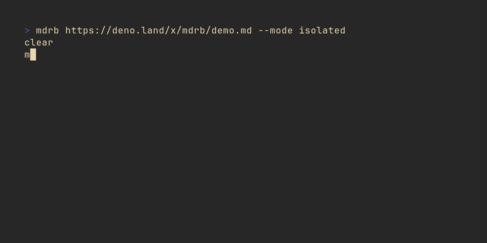

<h1 align="center">
	<br>
		
	<br>
	Markdown Run Book
	<br>
	<br>
</h1>

<p align="center">Turn your Markdown documentation into executable runbooks.</p>

<p align="center">
	<a href="https://github.com/andrewbrey/mdrb/actions/workflows/ci.yml">
		
	</a>
	<a href="https://deno.land/x/mdrb">
		
	</a>
</p>

---

## Features

- 🦕 Built with and runs on [Deno](https://deno.land)
- 🌀 Blend documentation with code execution; bring your `README.md` developer setup to life without losing the
  narrative format
- ✅ Execute `TypeScript` and `JavaScript` fenced code blocks as a multi-step "runbook"
- ✨ Automatic availability of [dsherret/dax](https://deno.land/x/dax) within code blocks to simplify cross-platform
  shell execution
- ⬇ Works with local and remote Markdown files and even Markdown content piped to `stdin`

## Motivation and How it Works

How many times have you had to follow along with a set of steps in a `README.md` in order to setup your development
environment to work on a project? Copy-and-Paste-ing from the `README` to your terminal back and forth, hoping you do
each step correctly and don't miss something gets old; wouldn't it be nice if you could just _execute_ the code in that
`README`? Well, that's what `mdrb` allows you to do!

When provided a Markdown file (or a remote URL that points to one, or pipe the content of one through `stdin`) to
`mdrb`, it does the following:

1. Extract all of the _fenced_ code blocks which are annotated with a valid `TypeScript` or `JavaScript` language code
   (`typescript`, `ts`, `javascript`, and `js`)
1. Pull out the code from each and do a bit of processing to allow it to work seamlessly with `Deno`
   - for example, references to `import.meta.url` need to be rewritten with the litteral value of the source Markdown
     file
1. (_optionally, but by default_) add an import of the bundled version of [dax](https://deno.land/x/dax) to the code
   that will be executed
   - From the `dax` module the `$` object is exposed automatically to your code blocks, allowing them to transparently
     reference the functions and features (of which there are many) of `$` - most important of which is the execution of
     cross-platform shell commands.
1. Execute the code blocks according to the chosen mode; by default the "`runbook`" mode is used, which treats each code
   block as an isolated script and execution is paused awaiting your confirmation before going on.
   - "`isolated`" mode is the same as "`runbook`" mode, except that there is no pause to prompt between each code block.
     This is the mode used instead of `runbook` for all _piped_ content due to the absence of a `tty`.
   - "`single`" mode concatenates your code blocks together as if they were all a single script and executes the
     resulting _single_ block. In this mode, your code blocks can depend on each other, but be careful about things like
     re-declaring variables across code blocks - at runtime, they aren't isolated from each other!

## Installation

```sh
deno install -Arfn mdrb https://deno.land/x/mdrb/mod.ts
```

> Note: if you prefer not to bake `--allow-all` permissions (with the `-A` flag) into the installed command, you can
> specify alternate permissions, e.g. `deno install --allow-net -rfn mdrb https://deno.land/x/mdrb/mod.ts` but be aware
> that this means you will be prompted for permissions at runtime.

## Demos

### Local Markdown

> Within the source repository for `mdrb`, execute `mdrb` on the local [demo.md file](demo.md). This results in
> executing the 3 included (`ts/js`) code blocks as a "runbook", pausing execution after each step awaiting user
> confirmation to proceed.


### Remote Markdown

> Just like when we referenced the local `demo.md` file, we can also just reference the demo Markdown by a URL.

🧪 Try it yourself with:

```sh
mdrb https://deno.land/x/mdrb/demo.md
```



> Note that in this demo, we used "`isolated`" mode instead of the default "`runbook`" mode which omits the pauses for
> confirmation between code blocks

### Piped Markdown

> We can also pipe the Markdown content to `mdrb`


> Note that for this demo, even though we didn't manually specify "`isolated`" mode, `mdrb` used it instead of the
> normal default of "`runbook`" mode because the prompts will fail if we don't have a `tty`

### Using `dax`

> There are a **ton** of useful things you can do with `dax`, so here's a little showcase of _some_ of what you can do
> with the automatically added `$` object.


### Skipping automatic `dax` addition

> If you don't want `dax` to be automatically added to your code blocks, you can pass the `--dax=false` option


### Step Configuration

It is possible to (_optionally_) configure your code blocks using an HTML `<details data-mdrb>` element which comes
immediately before your code blocks. Each `ts / js` fenced code block can have its own configuration (though one is not
required). The contents of your code block configuration can change aspects of how `mdrb` will execute.

By providing configuration within a preceding `<details data-mdrb>` element, most places where Markdown is rendered will
display the configuration information natively as a collapsed dropdown.

The configuration syntax supports two features within a `<details data-mdrb>` element:

- a value which specifies a "step name / title", and this is provided as the `<summary>` element directly inside of the
  `<details data-mdrb>`.
- a value which is [TOML](https://toml.io/) formatted configuration placed inside of a `<pre>` element below the
  `<summary>` element.
  > **Warning** the `<pre>` _must have_ a newline before it (a blank line between the `<summary>` and the `<pre>`) and
  > its content _must not be_ indented (otherwise the Markdown parser will classify the content as an "indented code
  > block" which is another feature of Markdown)

If you include the `<details data-mdrb>` element for step configuration (again, it's optional), you may specify within
it both a `<summary>` and a `<pre>`, only a `<summary>`, only a `<pre>`, or neither. Basically, everything about this
step configuration is optional and `mdrb` will use default values in the absence of user-provided configuration
overrides.

#### Important Notes About Configuration

Here is an example of a valid, and configured, step:

````md
> ... preceding Markdown content

<details data-mdrb>
<summary>Log a diagnostic message</summary>
</details>

```ts
console.log("hello from this configured step!");
```

> ... the rest of the Markdown
````

Please note the following:

- The `<details>` element has an attribute of `data-mdrb`, which is required to signal to `mdrb` that this `<details>`
  is meant to configure a code block
- The `<summary>` element is nested inside of the `<details data-mdrb>` element

With this configuration in place, when executed this Markdown will show (with the first line dimmed in your terminal):

```
step 1 of 1 // Log a diagnostic message

hello from this configured step!
```

Here is an example of a step with a "full" configuration:

````md
> ... preceding Markdown content

<details data-mdrb>
<summary>Log a diagnostic message</summary>

<pre>
description = '''
# important step

> I can have blockquotes!

basic demonstration of the fact that
you can log to the console with code
blocks.
'''
</pre>
</details>

```ts
console.log("hello from this configured step!");
```

> ... the rest of the Markdown
````

In this example notice the following:

- The `<pre>` has a blank line before it separating it from the `<summary>`
- The text content of the `<pre>` is not indented _at all_ and is valid `TOML`
- This example has a single key-value pair, showing the ability to use multiline `TOML` strings as well as the fact that
  the `description` key can contain Markdown content

Today, the only key from the `<pre>` which may be used when specified is the `description`. This key can have either a
single-line value or a multi-line value, and further, the value can contain Markdown which will be beautifully rendered
in the terminal when you use "`runbook`" mode _or_ when you use "`isolated`" mode with the `--isolated-desc=true` flag.

Beyond the `description` key, no other configuration values are used, even if they are well defined according to these
rules, however in the future, there may be additions to the way you can configure `mdrb` execution exposed through these
configuration values.

Some possible examples of things which may be included are:

- Skip the automatic addition of `dax` for a given code block
- Conditionally skip a code block entirely (say, for instance, if you were on Windows or Mac but not on Linux)
- Your ideas? Make an issue or PR and it will be considered

## Prior Art

- https://github.com/jacobdeichert/mask
- https://github.com/c4spar/deno-dzx
- https://github.com/google/zx

## License

[MIT](./LICENSE). Copyright (c) [Andrew Brey](https://andrewbrey.com)
